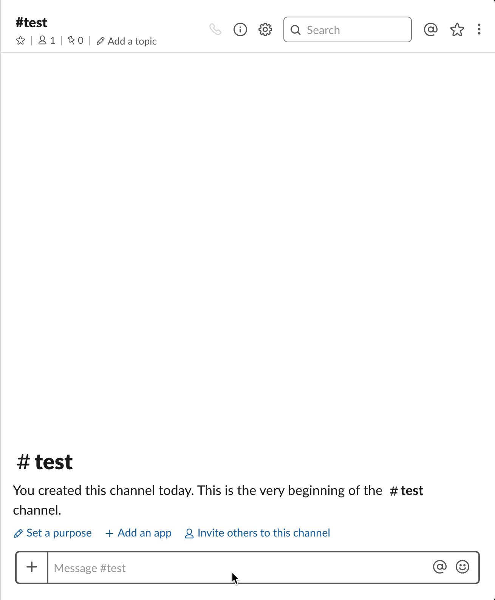

# OmbiBot

> A bot to ombi with



## Prerequisites

1. Ruby >= 1.9.3
2. Bundler/RubyGems

## Installation

1. Install dependencies

```
$ bundle install
```

## Running

1. Replace environment variables

   1. create a file in the /config called `.env`
   1. copy from `.env.example` and replace with your values (leave slack one empty for now)

2. Start the server

```
$ bundle exec foreman start
```

3. Host it somewhere with an SSL cert (needed for interactions)

4. Set up Slack bot

   1. [Create a Slack app](https://api.slack.com/apps) and configure it in your workspace
   2. Add Bots, Interactive Components, and Permissions
   3. Configure `.env` with `Bot User OAuth Access Token` from `OAuth and Permissions` sidebar tab
   4. Configure the `Request URL` on `Interactive Components` to the URL from #3 above

5. ?

6. Profit!

## How to use:

```
plex search ricky bobby
```

will return Talladega Nights: The Ballad of Ricky Bobby

Command Structure:

```
[trigger] [command] [expression]
```

- `trigger` - one of "plex" or "ombibot" or "ombi"
- `command` - one of "download" or "find" or "search" or "get" or "request"
- `expression` - the movie you're searching for (TV support coming soon.)

You can also send DMs to the bot, for your more embarassing requests. The DMs don't require the trigger word.

## Built With:

[Slack Ruby Bot](https://github.com/dblock/slack-ruby-bot)
